# FraudLens AI — Multimodal AI Fraud Investigation Platform

<div align="center">

### AI-Powered Financial Evidence Forensics

FraudLens AI is a multimodal fraud investigation platform that brings financial documents, transaction data, computer vision, OCR, anomaly detection, and AI-assisted investigation into a single forensic workspace.

<br>

[](https://d21zw6n2b48e0s.cloudfront.net/)

### ☁️ AWS Infrastructure

[](https://aws.amazon.com/)
[](https://aws.amazon.com/cloudfront/)
[](https://aws.amazon.com/s3/)
[](https://aws.amazon.com/ecr/)
[](https://aws.amazon.com/elasticbeanstalk/)

### 🧠 Application Stack

[](https://react.dev/)
[](https://www.typescriptlang.org/)
[](https://nodejs.org/)
[](https://www.python.org/)
[](https://www.docker.com/)
[](https://www.mongodb.com/)
[](https://ai.google.dev/)
[](https://firebase.google.com/)

</div>

---

## 📌 Table of Contents

- [Overview](#overview)
- [The Problem](#the-problem)
- [The Solution](#the-solution)
- [Core Concept](#core-concept)
- [How FraudLens AI Works](#how-fraudlens-ai-works)
- [Investigation Workflow](#investigation-workflow)
- [Platform Modules](#platform-modules)
- [Multimodal Evidence Analysis](#multimodal-evidence-analysis)
  - [OCR & Document Intelligence](#ocr--document-intelligence)
  - [Computer Vision & Forensics](#computer-vision--forensics)
  - [Anomaly Detection (Machine Learning)](#anomaly-detection-machine-learning)
  - [Evidence Fusion Engine](#evidence-fusion-engine)
  - [Transaction Intelligence](#transaction-intelligence)
  - [AI Investigator](#ai-investigator)
- [System Architecture](#system-architecture)
- [AWS Architecture](#aws-architecture)
- [AWS Services Explained](#aws-services-explained)
- [Security & Authentication](#security--authentication)
- [API Architecture](#api-architecture)
- [Application Design](#application-design)
- [Technology Stack](#technology-stack)
- [Major Functional Areas](#major-functional-areas)
- [Local Development](#local-development)
- [Docker](#docker)
- [AWS Deployment Flow](#aws-deployment-flow)
- [Design Philosophy](#design-philosophy)
- [Project Evolution](#project-evolution)
- [Future Improvements](#future-improvements)
- [Project Status](#project-status)
- [Project Links](#project-links)

---

## Overview

Fraud detection traditionally focuses on structured transaction data. A transaction is typically classified as:

```text
NORMAL   or   SUSPICIOUS
```

Real investigations are rarely limited to a single transaction. An investigator may need to examine:

- Invoices and receipts
- Transaction records
- Merchant information
- Signatures and identity documents
- Uploaded images
- OCR-extracted information
- Transaction patterns
- Previous investigation evidence

The challenge is that these sources often exist independently. **FraudLens AI brings these signals together.** Instead of treating every piece of evidence as an isolated input, the platform creates an investigation context where multiple sources can be analyzed and compared.

---

## The Problem

Financial fraud investigations can involve a large amount of heterogeneous evidence. A suspicious transaction by itself may not provide enough context to understand what happened.

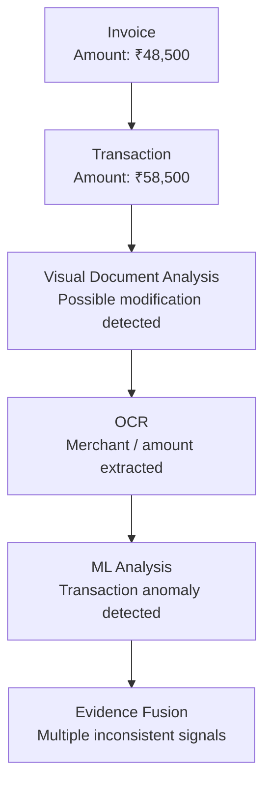

The important question becomes:

> **How do the different pieces of evidence relate to one another?**

FraudLens AI is designed around this investigation problem.

---

## The Solution

FraudLens AI combines multiple analytical layers into one workflow.

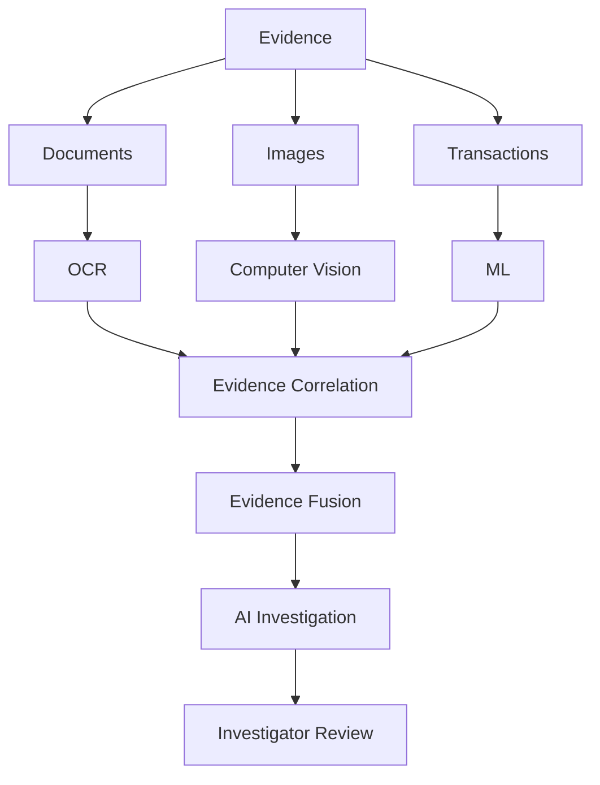

The platform focuses on **investigation support**, rather than simply producing a fraud / not-fraud prediction.

---

## Core Concept

FraudLens AI follows a simple principle:

> **A fraud signal becomes more useful when it can be connected to supporting evidence.**

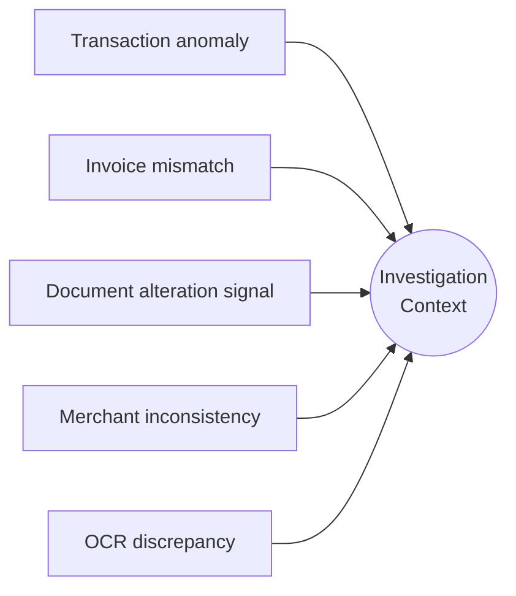

The system brings these signals together so an investigator can review the evidence in one place.

---

## How FraudLens AI Works

The complete investigation pipeline:

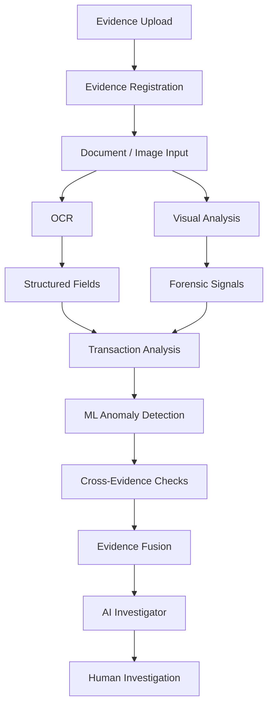

---

## Investigation Workflow

### 1. Create an Investigation

An investigator begins by creating an investigation workspace, which acts as the central container for:

- Evidence
- Transactions
- Analytical results
- Findings
- AI-generated investigation context
- Reports

### 2. Add Evidence

Evidence can include financial documents, images, transaction information, and other investigation artifacts. Each evidence item becomes part of the investigation context.

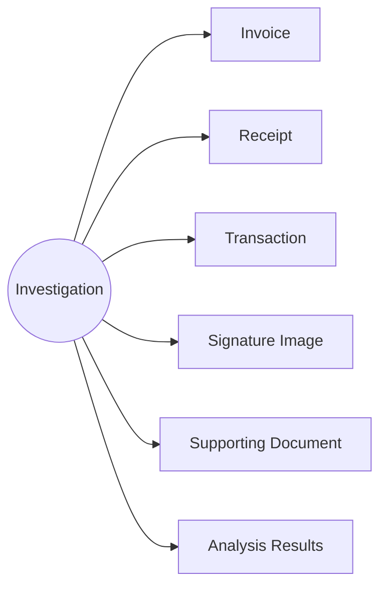

### 3. Extract Information

Documents are processed through OCR and document analysis. Extracted fields can include:

- Merchant
- Transaction Amount
- Date
- Reference Number
- Account Information
- Invoice Information

These values can then be compared with other evidence.

### 4. Analyze Visual Evidence

Uploaded images can be inspected through forensic visualization tools. The Forensic Viewer provides multiple analytical views instead of displaying only the original image.

### 5. Run Transaction Analysis

Transaction data is evaluated using machine learning and rule-based evidence checks. The system can identify anomalous transaction patterns and potentially suspicious characteristics.

### 6. Compare Evidence

The Evidence Fusion Engine checks whether information across evidence sources is consistent.

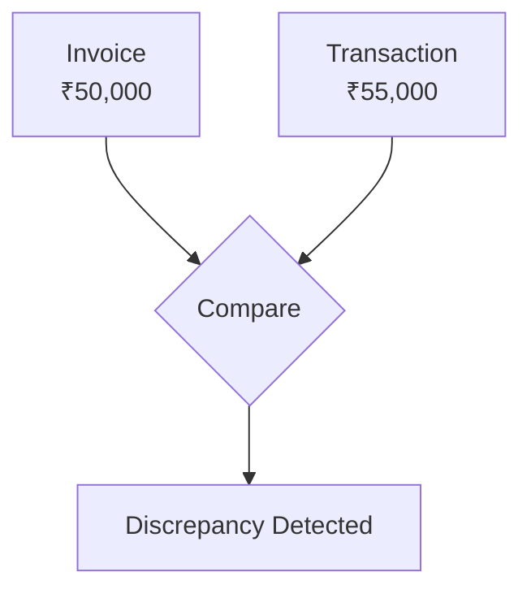

### 7. AI-Assisted Investigation

The available evidence and analytical results are provided to the AI investigation layer, which helps synthesize investigation context into structured insights.

### 8. Human Review

FraudLens AI is designed to **support** investigators. The final investigation remains a human-driven process where evidence can be reviewed, compared, and validated.

---

## Platform Modules

### Executive Overview

A high-level view of the investigation environment. It can surface:

- Investigation statistics
- Evidence statistics
- Transaction signals
- Suspicious activity
- Analytical indicators
- Investigation activity

### Evidence Vault

The centralized evidence repository, giving investigators a single place to access investigation artifacts and reducing fragmentation during an investigation.

Typical categories: Documents, Images, Invoices, Receipts, Transactions, Supporting Evidence, Analysis Results.

### Forensic Viewer

An investigation-oriented interface for image analysis. Instead of showing only the original image, it provides multiple analytical views:

| View | Purpose |
|------|---------|
| **Normal View** | Displays the original evidence |
| **Heatmap View** | Visual overlays highlighting potentially suspicious image regions |
| **OCR Bounding Boxes** | Displays extracted text locations on the document |
| **Edge Analysis** | Examines image edges and structural changes |
| **Contrast Analysis** | Another visual signal for inspecting manipulated regions |

> These views are forensic **signals** for investigation, not standalone proof of fraud.

### Cross-Evidence Matrix

Helps investigators understand relationships between evidence items.

| | Invoice | Transaction | Signature | Merchant |
|---|:---:|:---:|:---:|:---:|
| **Invoice** | ✓ | ✓ | - | ✓ |
| **Transaction** | ✓ | ✓ | - | ✓ |
| **Signature** | - | - | ✓ | - |
| **Merchant** | ✓ | ✓ | - | ✓ |

### Analytics

Provides visibility into investigation and transaction-level information, including transaction patterns, anomaly indicators, investigation activity, evidence statistics, and analytical results. The objective is to turn raw investigation data into information that can be reviewed efficiently.

### AI Investigator

The generative AI component of FraudLens AI. See [AI Investigator](#ai-investigator).

---

## Multimodal Evidence Analysis

### OCR & Document Intelligence

OCR converts visual document content into structured information for downstream analysis. This is especially useful when important values exist inside documents rather than structured databases.

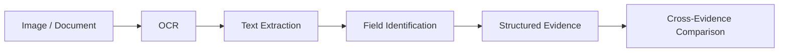

### Computer Vision & Forensics

Computer vision provides additional evidence signals from images. The system can examine:

- Image structure
- Edges
- Contrast
- Visual regions
- OCR locations
- Potential manipulation indicators

These signals are presented through the Forensic Viewer so an investigator can inspect the evidence directly.

### Anomaly Detection (Machine Learning)

FraudLens AI combines supervised machine learning with unsupervised anomaly detection.

| Model | Role |
|-------|------|
| **XGBoost** | High-performance supervised approach for classification-oriented fraud analysis |
| **Isolation Forest** | Unsupervised approach for identifying observations that differ from normal transaction behavior |
| **Decision Tree** | Retained as a baseline model from the earlier fraud detection implementation |
| **SVM** | Retained as a historical baseline |

This preserves the evolution from the original ML-based fraud classifier toward the broader multimodal investigation platform.

### Evidence Fusion Engine

One of the central ideas behind FraudLens AI. Instead of asking:

> *"Is this transaction suspicious?"*

the system asks:

> *"Are the available pieces of evidence consistent with one another?"*

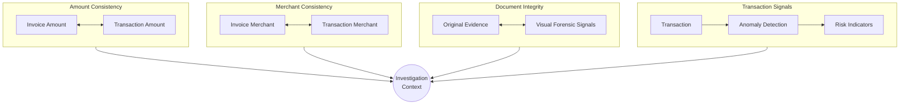

### Transaction Intelligence

Transaction analysis provides the structured-data side of the investigation. Potential signals include:

- Unusual transaction behavior
- Suspicious merchant categories
- Transaction inconsistencies
- Amount mismatches
- PIN bypass indicators
- Relationships between transaction records and uploaded evidence

The transaction layer becomes more useful when combined with document and visual evidence.

### AI Investigator

The AI Investigator uses the investigation context (powered by Google Gemini) to assist with:

- Evidence interpretation
- Finding synthesis
- Investigation questions
- Cross-evidence reasoning
- Structured forensic summaries

The AI layer is **not** intended to replace investigator judgment.

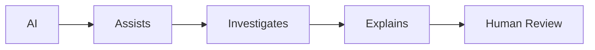

---

## System Architecture

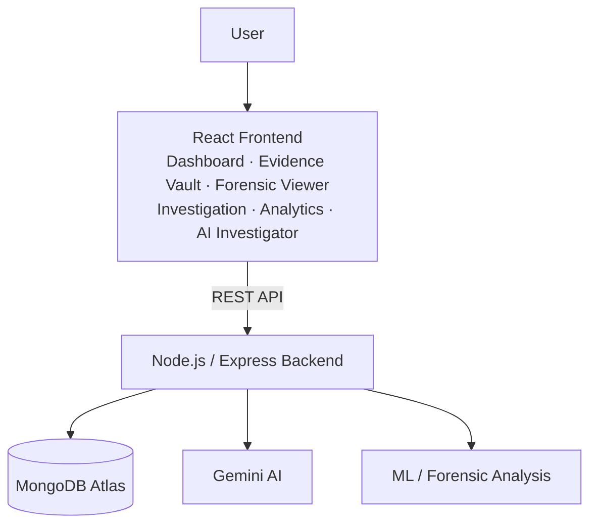

---

## AWS Architecture

The production application is deployed on AWS using a containerized architecture.

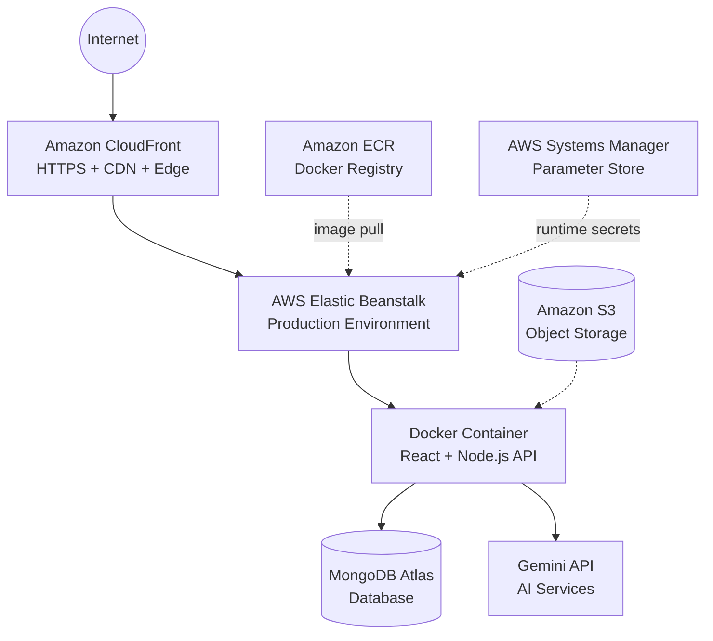

---

## AWS Services Explained

### Amazon CloudFront

Provides the public HTTPS entry point for the application:

```text
https://d21zw6n2b48e0s.cloudfront.net
```

- HTTPS delivery
- CDN capabilities
- Global edge distribution
- Public application access
- An AWS-managed production endpoint

### Amazon S3

Provides durable cloud object storage for application assets and evidence-related objects. The architecture can separate **application runtime** from **object storage**, so large files and evidence objects are handled independently from application compute.

### Amazon ECR

Amazon Elastic Container Registry stores the Docker images used for deployment, acting as the registry layer between local development and the AWS production environment.

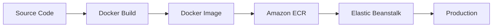

### AWS Elastic Beanstalk

Provides the production environment for the Dockerized application. Instead of manually configuring the application server, Beanstalk manages the application environment. The deployed container holds the unified application:

- React Frontend
- Node.js / Express
- REST API
- Application Services

---

## Security & Authentication

### Secrets Management

FraudLens AI keeps sensitive configuration outside the application source code. Runtime secrets include:

```text
GEMINI_API_KEY
MONGODB_URI
JWT_SECRET
```

These values are stored using **AWS Systems Manager Parameter Store**:

| Location | Secrets |
|----------|:-------:|
| Source Code | ✕ |
| AWS Runtime Configuration | ✓ |

This prevents credentials from being intentionally committed to Git.

### Authentication

**Firebase Authentication** handles user authentication and supports:

- Google authentication
- Email/password authentication
- Demo investigator accounts

Authentication is handled separately from the core investigation logic, so the investigation system can focus on evidence and analysis.

---

## API Architecture

The backend exposes a REST API under `/api/v1`, covering: Investigations, Evidence, Transactions, Analytics, Reports, AI Assistant, and Health.

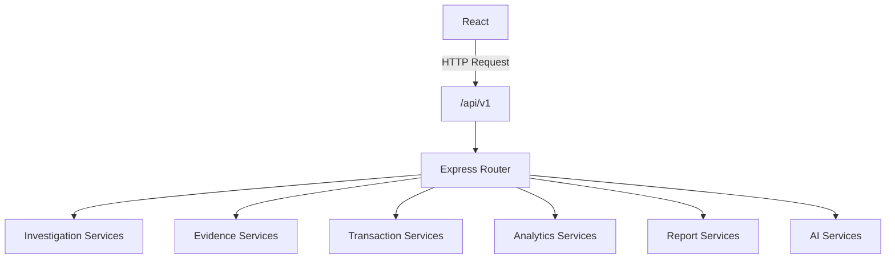

### Health Monitoring

The production backend exposes a health endpoint:

```text
/api/v1/health
```

This lets the deployed environment be checked independently from the frontend. The response reports service-level information for **API, MongoDB, AI Services, OCR,** and **Forensic Analysis**, making it easier to verify the complete production stack.

---

## Application Design

FraudLens AI uses a modular, SaaS-oriented structure. The frontend is separated into functional areas rather than a single page, making it easier to extend as new investigation capabilities are added.

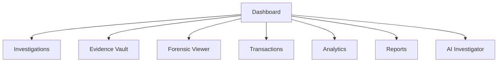

### Production-Oriented Design

The project is not limited to a single machine learning notebook. It combines:

> Frontend · Backend · Database · Authentication · Machine Learning · Computer Vision · OCR · Generative AI · Docker · Cloud Infrastructure · Production Deployment

This demonstrates the complete lifecycle from model experimentation to an accessible application.

---

## Technology Stack

| Layer | Technology |
|-------|------------|
| Frontend | React |
| Language | TypeScript |
| Build Tool | Vite |
| Backend | Node.js |
| API Framework | Express |
| Machine Learning | Python |
| ML Libraries | Scikit-learn, XGBoost |
| Data Processing | Pandas, NumPy |
| Visualization | Matplotlib |
| AI | Google Gemini |
| Computer Vision | Image Forensic Analysis |
| OCR | OCR / Document Extraction |
| Database | MongoDB Atlas |
| Authentication | Firebase Authentication |
| Containerization | Docker |
| Container Registry | Amazon ECR |
| Application Hosting | AWS Elastic Beanstalk |
| CDN | Amazon CloudFront |
| Object Storage | Amazon S3 |
| Secrets | AWS Systems Manager Parameter Store |
| Cloud Platform | AWS |

---

## Major Functional Areas

```text
FraudLens AI
│
├── Executive Overview
├── Investigation Workspace
├── Evidence Vault
├── Forensic Viewer
│   ├── Normal View
│   ├── Heatmap
│   ├── OCR Bounding Boxes
│   ├── Edge Analysis
│   └── Contrast Analysis
├── Cross-Evidence Matrix
├── Transaction Analysis
├── Analytics
├── Reports
├── AI Investigator
├── Authentication
└── ML / Forensic Analysis
```

---

## Local Development

### Prerequisites

- Node.js
- npm
- Python
- MongoDB connection
- Docker
- Git

### Clone the Repository

```bash
git clone https://github.com/pathananas2007/fraudlens-ai.git
cd fraudlens-ai
```

### Install Dependencies

```bash
npm install
```

If the Python ML components are required:

```bash
pip install -r requirements.txt
```

### Environment Variables

Create a local `.env` file for development:

```env
GEMINI_API_KEY=your_gemini_api_key
MONGODB_URI=your_mongodb_connection_string
JWT_SECRET=your_jwt_secret
FRONTEND_URL=http://localhost:3000
```

Firebase client configuration can be provided through the appropriate frontend environment variables.

> ⚠️ **Never** commit real API keys, database credentials, JWT secrets, or other private credentials to Git.

### Run the Development Environment

```bash
npm run dev
```

The exact development ports depend on the current project configuration.

---

## Docker

Build the application:

```bash
docker build -t fraudlens-ai .
```

Run the container:

```bash
docker run -p 3000:3000 fraudlens-ai
```

The production deployment uses the same containerized application model, so development and production share a consistent runtime.

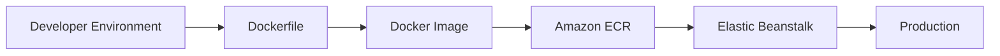

---

## AWS Deployment Flow

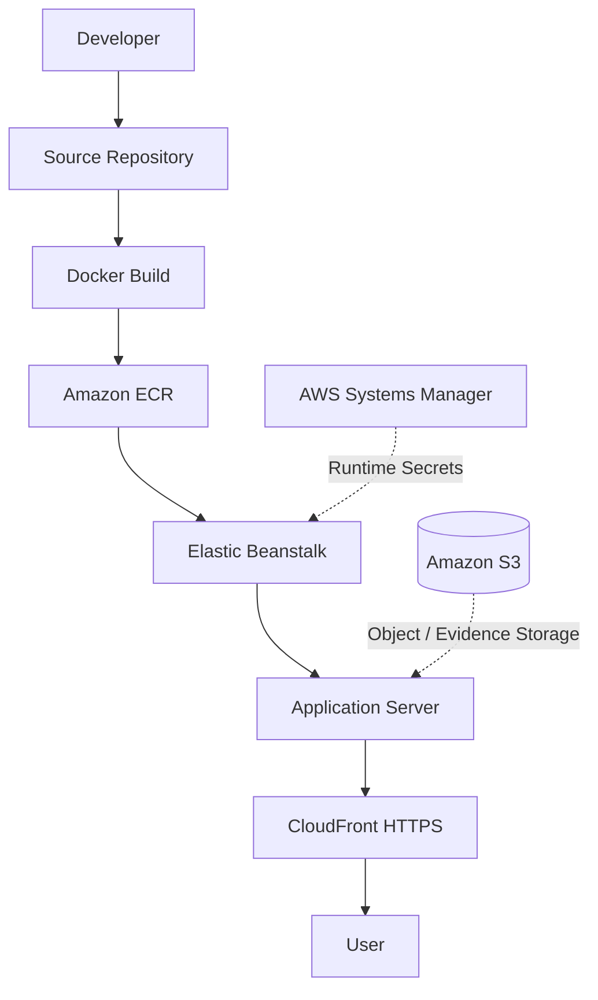

### Production Endpoints

| Resource | URL |
|----------|-----|
| Live Demo | https://d21zw6n2b48e0s.cloudfront.net/ |
| Health Check | https://d21zw6n2b48e0s.cloudfront.net/api/v1/health |

---

## Design Philosophy

FraudLens AI is built around four principles:

1. **Evidence First** — The system starts with evidence rather than treating the ML prediction as the final answer.
2. **Multimodal Analysis** — Different evidence formats contribute different signals.
3. **Explainable Investigation** — The investigator can inspect the evidence and analytical signals behind an investigation.
4. **Human-in-the-Loop** — AI assists investigation workflows while human review remains central to interpreting evidence and making decisions.

---

## Project Evolution

FraudLens AI originated from a traditional machine-learning fraud detection implementation:

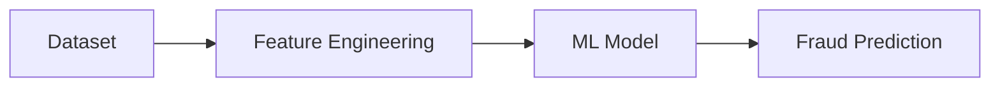

It was then expanded into a multimodal investigation platform:

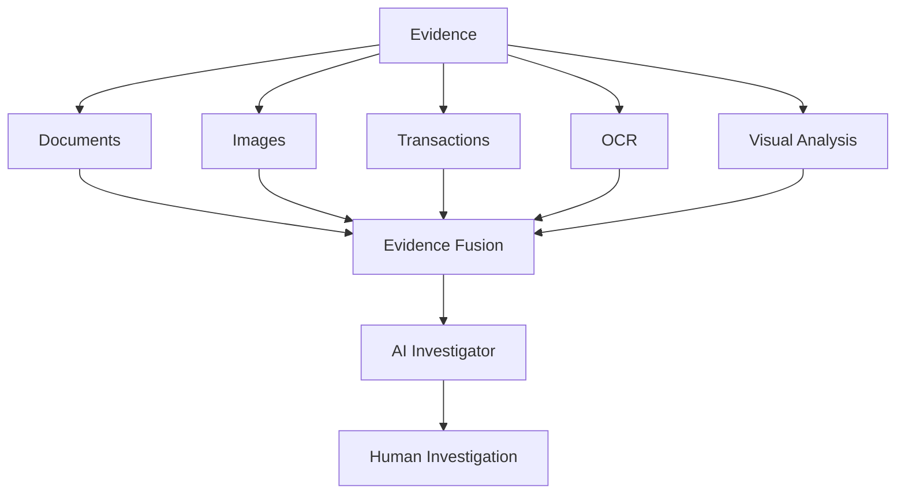

This evolution changed the focus from simply **predicting** fraud to helping **investigate** fraud.

### Development Workflow

The project was developed iteratively:

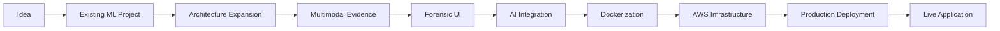

AI-assisted development tools were also used during engineering to accelerate implementation, debugging, architecture work, and deployment tasks.

---

## Future Improvements

- More advanced multimodal models
- Improved document understanding
- Additional fraud datasets
- Graph-based evidence relationships
- Advanced transaction risk scoring
- Automated investigation timelines
- More detailed audit trails
- Role-based investigator permissions
- Expanded cloud-native storage workflows
- Automated model monitoring
- Model explainability dashboards
- Investigation collaboration
- Advanced report generation
- Additional forensic image techniques

### Future Architecture Direction

The current deployment uses a unified container architecture. A future cloud-native architecture could separate the major workloads so each component scales independently:

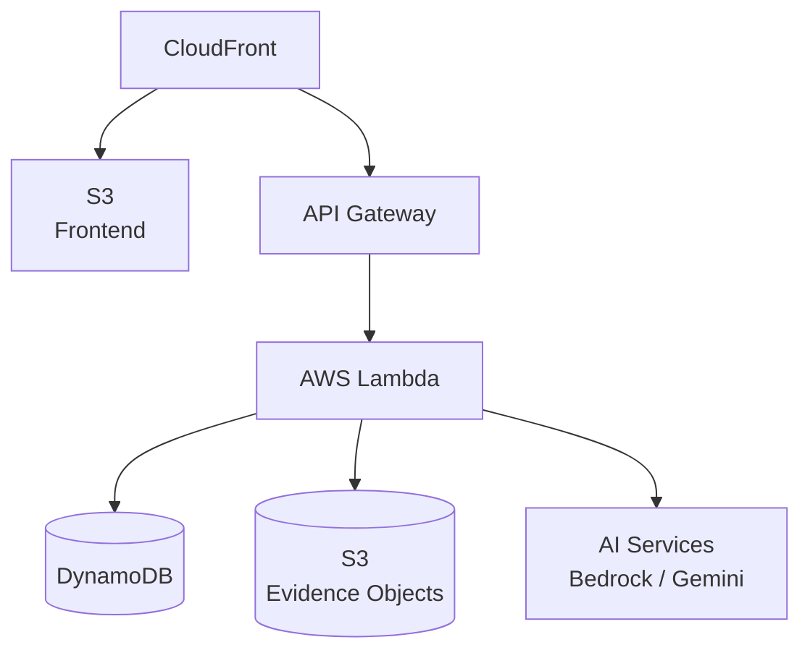

---

## Project Status

- ✅ Deployed to production on AWS (CloudFront → Elastic Beanstalk → Docker)
- ✅ Multimodal investigation workflow: evidence, OCR, forensics, ML, AI
- ✅ Firebase authentication with demo investigator accounts
- 🚧 Ongoing: see [Future Improvements](#future-improvements)

### Project Objective

FraudLens AI demonstrates how modern AI, machine learning, computer vision, and cloud infrastructure can be combined into a practical investigation workflow, covering the complete journey:

```mermaid
flowchart LR
    A["BUILD"] --> B["ANALYZE"] --> C["CORRELATE"] --> D["INVESTIGATE"] --> E["SHIP"]
```

Rather than presenting only a machine-learning model, it brings together the surrounding engineering required to turn analytical models into a usable application.

---

## Project Links

- 🌐 **Live Application:** https://d21zw6n2b48e0s.cloudfront.net/
- 💻 **GitHub Repository:** https://github.com/pathananas2007/fraudlens-ai

### 👨‍💻 Built With

React · TypeScript · Node.js · Express · Python · Scikit-learn · XGBoost · MongoDB · Gemini · Firebase · Docker · Amazon S3 · Amazon ECR · AWS Elastic Beanstalk · Amazon CloudFront

---

<div align="center">

**FraudLens AI**

Multimodal AI for Financial Evidence Forensics

*Detect → Analyze → Correlate → Investigate*

</div>
